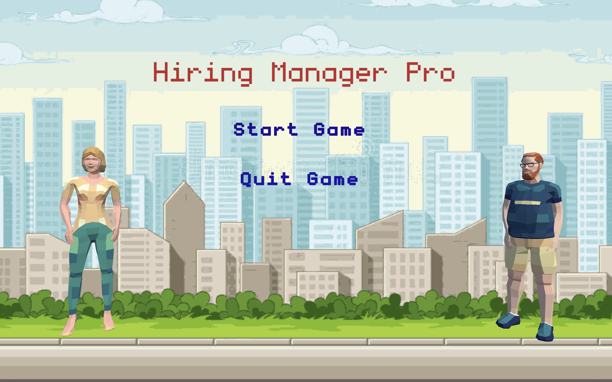
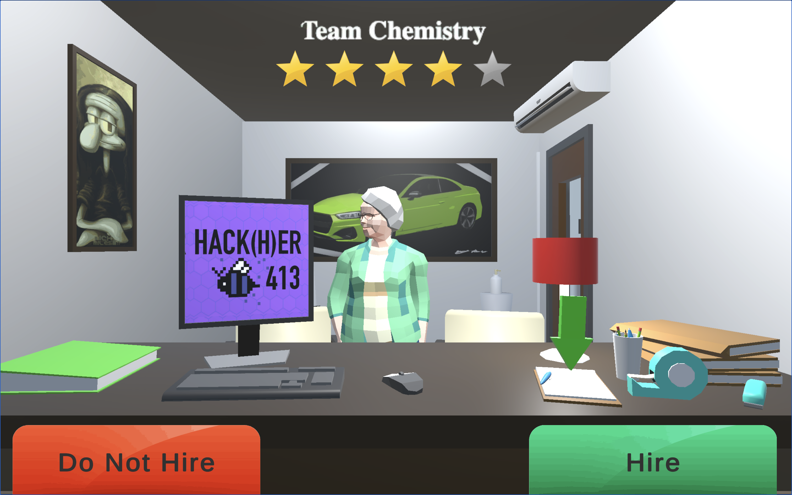

# Hiring Manager Pro

Hiring Manager Pro is a 3D simulation game built in Unity that puts players in the shoes of a corporate recruiter. Players must evaluate procedurally generated candidates and build a balanced 5-person team. The game challenges players to weigh raw technical skills against adaptability, culture add, and hidden potential to achieve a perfect 5-star team rating.

[Play Hiring Manager Pro Here](https://benzislin.itch.io/hiringmanagerpro)

